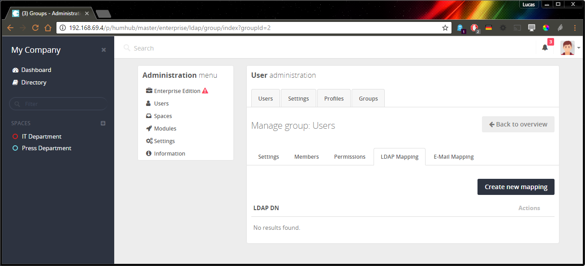

# Manual

User Mapping
------------

You can assign user's group or Space memberships automatically using LDAP.

**Mapping Options:**

- User LDAP group memberships (memberOf field, e.g. CN=xyz_space_access,OU=Groups,DC=example,DC=com)
- The part of the users base DN (e.g. OU=People,DC=example,DC=com)
- Attribute values (e.g. street==Some Street or street=~Street)
- LDAP Query

> Note: If the option 'Fetch/Update Users Automatically' is activated, the mappings are automatically updated every hour. 
> Also, the mappings are updated each time a user logs in.

### Space Mapping


If the Advanced LDAP module is enabled, the space mapping can be configured in the respective space under 
`Space Settings Menu -> Members -> LDAP`.

> Note: This LDAP mapping can only be set by HumHub administrators. 
> A Space Administrator does not have access to this setting for security reasons.

Configuration page: `Open Space` -> `Members` -> `LDAP`


### Group Mapping

A mapping based on user groups can be defined under `Administration -> Users -> Groups -> Select a group -> LDAP`.



### Group Mapping

Profile Images
--------------

You can also synchronize profile image from LDAP.

Modify your [configuration files](https://docs.humhub.org/docs/admin/advanced-configuration) `protected/config/common.php` and add following section:

```
<?php

return [
    'components' => [
        'authClientCollection' => [
            'clients' => [
                'ldap' => [
                    'class' => 'humhub\modules\advancedLdap\authclient\LdapAuth',
                    'profileImageAttribute' => 'thumbnailphoto'
                ]
            ]
        ]
    ]
];
```

In this example, it is assumed that the image is stored in the LDAP attribute 'thumbnailphoto'. 
If another attribute is used, the configuration must be changed accordingly.

Multiple LDAP servers
---------------------

If several different LDAP servers are used, the complete LDAP configuration must be organised via the [configuration files](https://docs.humhub.org/docs/admin/advanced-configuration).

> Note: With the LDAP CLI tools, a `clientId` can always be passed as an additional parameter to define the desired LDAP connection.

When a user logs in, an authentication with the specified LDAP sources is attempted one after the other.

```php
return [
    'components' => [
        'authClientCollection' => [
            'clients' => [
                'ldapServer1' => [
                    'class' => 'humhub\modules\advancedLdap\authclient\LdapAuth',
                    'clientId' => 'ldapServer1',
                    'hostname' => 'ldap1.example.com',
                    'port' => 636,
                     #'useStartTls' => true,
                    'useSsl' => true,
                    'baseDn' => 'dc=company1,dc=com',
                    'bindUsername' => 'cn=admin,dc=company1,dc=com',
                    'bindPassword' => 'XXX',
                    'loginFilter' => '(uid=%s)',
                    'userFilter' => '(objectClass=posixAccount)',
                    'idAttribute' => 'uid',
                    'usernameAttribute' => 'uid',
                    'autoRefreshUsers' => true
                ],
                'ldapServer2' => [
                    'class' => \humhub\modules\ldap\authclient\LdapAuth::class,
                    'clientId' => 'ldapServer2',
                    'hostname' => 'ldap2.example.com',
                    'port' => 636,
                    'useSsl' => true,
                    'baseDn' => 'dc=company2,dc=com',
                    'bindUsername' => 'cn=admin,dc=company2,dc=com',
                    'bindPassword' => 'XXX',
                    'loginFilter' => '(uid=%s)',
                    'userFilter' => '(objectClass=posixAccount)',
                    'idAttribute' => 'uid',
                    'usernameAttribute' => 'uid',
                    'autoRefreshUsers' => true
                ],

            ]
        ]
    ]
];
```
